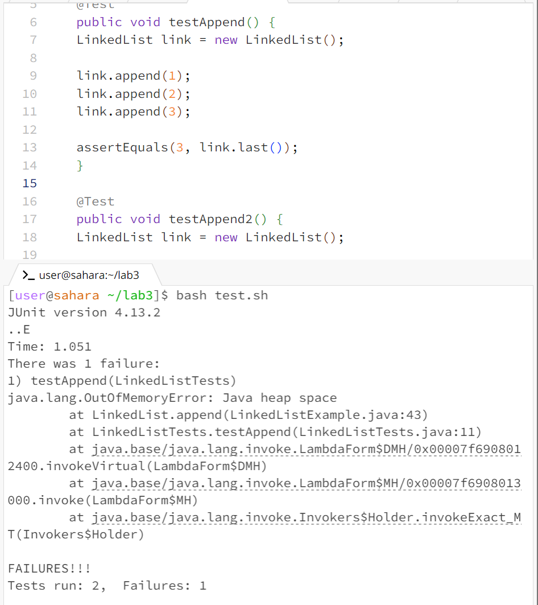

# CSE15L Lab 3

**Part 1 -- Bugs** <br>

Code for JUnit test that induced a failure: <br>
```
public class LinkedListTests {
	@Test 
	public void testAppend() {
    LinkedList link = new LinkedList();
    
    link.append(1);
    link.append(2);
    link.append(3);

    assertEquals(3, link.last());
	}
}

```
Code for JUnit test that does not induce a failure: <br>

```
public class LinkedListTests {
	@Test 
	public void testAppend() {
    LinkedList link = new LinkedList();
    
    link.append(1);
    link.append(2);

    assertEquals(2, link.last());
	}
}
```
The Symptom: <br>
 <br>

The Bug: <br>

  Before fix:
  ```
  while(n.next != null) {
              n = n.next;
              n.next = new Node(value, null);
          }
  ```

  After fix:
  ```
  while(n.next != null) {
              n = n.next;
          }
           n.next = new Node(value, null);
  ```
  
  The issue was in the LinkedListExample file, specifically with the append() method. While the method works fine when the linkedlist had zero or one element, when trying to append with the list having two elements already, the while loop would run forever, since it is stopping at n.next = null. With the n.next = new Node(value,null) line inside the while loop, the n.next will never be null, thus running forver and inducing the OutOfMemoryError as it is an infinite loop.
  To address the issue, the line n.next = new Node(value, null) was moved outside the while loop, so that it does the intended function of adding the new node that takes value to the end of the list. This way the while loop stops at the last element.


**Part 2 -- Researching Commands** <br>

4 ways to use the find command: <br>

find -name (Source -- https://www.redhat.com/sysadmin/linux-find-command) <br> 
	Ex1 <br>
	Input: <br>
 	```
  	find -name ar750.txt
  	```
 	Output: <br>
  	```
   	./biomed/ar750.txt
    	```
     	Ex2 <br>
	Input: <br>
 	```
  	find -name 1471-2091-2-12.txt
  	```
 	Output: <br>
  	```
   	./biomed/1471-2091-2-12.txt
    	```
find -type: (Source -- https://www.redhat.com/sysadmin/linux-find-command) <br>
Ex1 <br>
	Input: <br>
 	```
  	find -type d
  	```
 	Output: <br>
  	```
   	.
	./911report
	./biomed
    	```
Ex2 <br>
     	Input: <br>
 	```
  	find -type f
  	```
 	Output: <br>
  	```
   	./911report/chapter-13.3.txt
	./911report/chapter-13.5.txt
	./911report/chapter-8.txt
	./911report/chapter-1.txt
	./911report/chapter-5.txt
	./911report/chapter-10.txt
	./911report/chapter-3.txt
	./911report/chapter-6.txt
	./911report/chapter-9.txt
	./911report/chapter-12.txt
	./911report/chapter-11.txt
	./911report/chapter-13.4.txt
	./911report/preface.txt
	./911report/chapter-2.txt
 	... all the other files in the technical directory.
    	```
find -maxdepth: (Source -- https://adamtheautomator.com/bash-find/) <br>
Ex1 <br>
	Input: <br>
 	```
  	find -maxdepth 1 -type d
  	```
 	Output: <br>
  	```
   	.
	./911report
	./biomed
    	```
Ex2 <br>
     	Input: <br>
 	```
  	find -maxdepth 1 -type f
  	```
 	Output: <br>
  	```
   	nothing outputted
   	```
find -iname: (Source -- https://adamtheautomator.com/bash-find/) <br>
Ex1 <br>
	Input: <br>
 	```
  	find -iname chapter*
  	```
 	Output: <br>
  	```
   	./911report/chapter-13.3.txt
	./911report/chapter-13.5.txt
	./911report/chapter-8.txt
	./911report/chapter-1.txt
	./911report/chapter-5.txt
	./911report/chapter-10.txt
	./911report/chapter-3.txt
	./911report/chapter-6.txt
	./911report/chapter-9.txt
	./911report/chapter-12.txt
	./911report/chapter-11.txt
	./911report/chapter-13.4.txt
	./911report/chapter-2.txt
	./911report/chapter-13.1.txt
	./911report/chapter-13.2.txt
	./911report/chapter-7.txt
    	```
Ex2 <br>
     	Input: <br>
 	```
  	find -iname AR* 
  	```
 	Output: <br>
  	```
   	./biomed/ar619.txt
	./biomed/ar383.txt
	./biomed/ar612.txt
	./biomed/ar120.txt
	./biomed/ar68.txt
	./biomed/ar795.txt
	./biomed/ar792.txt
	./biomed/ar328.txt
	./biomed/ar387.txt
	./biomed/ar624.txt
	./biomed/ar140.txt
	./biomed/ar118.txt
	./biomed/ar79.txt
	./biomed/ar409.txt
	./biomed/ar104.txt
	./biomed/ar319.txt
	./biomed/ar321.txt
	./biomed/ar778.txt
	./biomed/ar407.txt
	./biomed/ar429.txt
	./biomed/ar615.txt
	./biomed/ar309.txt
	./biomed/ar297.txt
	./biomed/ar430.txt
	./biomed/ar745.txt
	./biomed/ar149.txt
	./biomed/ar408.txt
	./biomed/ar422.txt
	./biomed/ar601.txt
	./biomed/ar774.txt
	./biomed/ar799.txt
	./biomed/ar93.txt
	./biomed/ar130.txt
	./biomed/ar331.txt
	./biomed/ar750.txt
   	```

